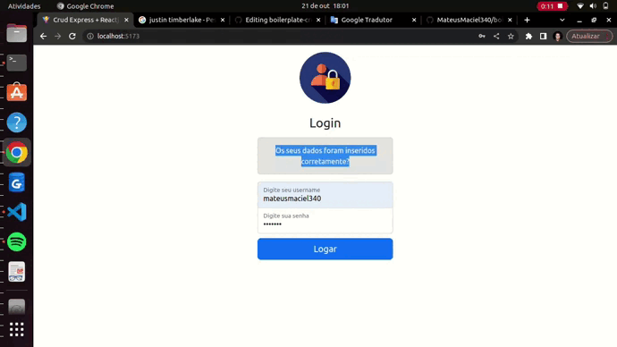

# Crud ExpressJs + ReactJs

<p align="center">
    
</p>

<p align="center">
    
    
    
    
    
</p>

## About:

The React development project is basically a simple crud, which stores username and image inside a mysql database.

It is a directed integration of the same api created by the developer of this project, this project has only the function of demonstrating a way to perform listing, removal, editing and registration of users.

Access the api: [API](https://github.com/MateusMaciel340/boilerplate-crud-javascript-express-mysql)

## Features:

The project was thought of objectively in the basic requirements that was just to perform the operation of the development of web applications (data manipulations).

### Example:

- Development of API host services
- Integration with user data (username and password)
- Creation of components that had spontaneous communication
- Fixed repeating classes and header bugs

## Layout:

<p align="center">
    
</p>

Video result can be seen on my linkedin - publications:
[mateusmaciel340](https://www.linkedin.com/in/mateusmaciel340/)

## How to run the project?

The project does not need to be in production so that it can run easily on your machine, you just need to put the implementations in their proper places, see how:

### Usage settings:

First of all, this frontend application only works with one api was created by this same developer.

Access the api: [API](https://github.com/MateusMaciel340/boilerplate-crud-javascript-express-mysql)

Run the features of this api, there is a specific documentation for each case.

#### Env:

There is only one environment variable found in `service`, namely `api.jsx`.

```bash
#baseURL: API_LOCAL
```

**file .env:**

``VITE_LOCAL_API=http://localhost:8080/api``

#### Running project:

```npm run dev```

## Technologies

The following tools were used in building the project:

### Frontend (React)

- JavaScript
- React
- Npm
- Api

## Contributors

<table>
    <thead>
        <tr>
            <td>
                
            </td>
        </tr>
    </thead>
    <tbody>
        <tr>
            <th>Mateus Maciel</th>
        </tr>
    </tbody>
</table>

## How to contribute?

1. Fork the project.
2. Create a new branch with your changes: `git checkout -b my-feature`
3. Save the changes and create a commit message telling what you did: `git commit -m Modifying this [...]`
4. Submit your changes: `git push origin my-feature`

## License

This project is under license [MIT](https://github.com/git/git-scm.com/blob/main/MIT-LICENSE.txt).